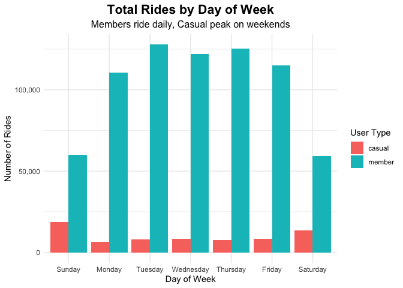
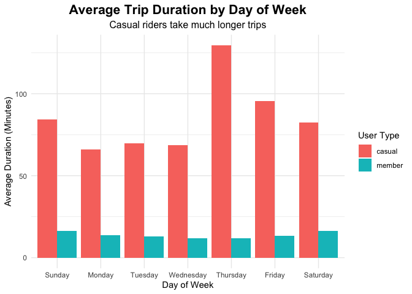

Cyclistic Bike-Share Analysis
================
Azhar Fachrezi
`2026-01-05`

# Executive Summary

**Goal:** Design marketing strategies to convert casual riders into
annual members. **Key Finding:** Casual riders use bikes for leisure on
weekends, while members use them for commuting on weekdays.
**Recommendation:** Introduce a “Weekend Warrior” membership tier to
target casual riders during their peak usage times.

------------------------------------------------------------------------

## Phase 1: Prepare & Process

I am using the `tidyverse` in R to handle the data processing and
visualization.

``` r
# Load Libraries
library("tidyverse")
library("lubridate")
library("scales") # For formatting numbers

# Load Dataset
data1 <- "Divvy_Trips_2019_Q1.csv"
data2 <- "Divvy_Trips_2020_Q1.csv"

df_2019 <- read_csv(data1)
df_2020 <- read_csv(data2)
```

------------------------------------------------------------------------

### Data Cleaning & Merging

It seems that the datasets from 2019 and 2020 have different column
names (e.g., `trip_id` vs `ride_id`). **Solution:** I renamed the 2019
columns to match the 2020 standard before merging them. I also
standardized the “User Type” labels to ensure consistency.

``` r
df_2019_clean <- df_2019 %>%
  rename(
    ride_id = trip_id,
    rideable_type = bikeid,
    started_at = start_time,
    ended_at = end_time,
    start_station_name = from_station_name,
    start_station_id = from_station_id,
    end_station_name = to_station_name,
    end_station_id = to_station_id,
    member_casual = usertype
  ) %>%
  mutate(
    ride_id = as.character(ride_id),
    rideable_type = as.character(rideable_type)
  )

# Merge
all_trips <- bind_rows(df_2019_clean, df_2020)

# Clean labels (Subscriber -> member)
all_trips <- all_trips %>%
  mutate(
    member_casual = recode(member_casual,
                           "Subscriber" = "member",
                           "Customer" = "casual"))
```

### **Feature Engineering**

To answer the business question, I need to calculate two key metrics: 1.
**Ride Length:** How long did each trip last? 2. **Day of Week:** On
which days are bikes used most?

*Note: I will filter out any “bad data” (negative ride lengths) caused
by system errors.*

``` r
all_trips_v2 <- all_trips %>%
  mutate(
    started_at = ymd_hms(started_at),
    ended_at = ymd_hms(ended_at),
    
    # Calculate duration in minutes
    ride_length_minutes = as.numeric(difftime(ended_at, started_at, units = "mins")),
    
    # Extract Day of Week
    day_of_week = wday(started_at, label=TRUE, abbr=FALSE)
  )%>%
  # Remove bad data (negative rides minutes)
  filter(ride_length_minutes > 0)
```

## **Phase 2: Analyze**

Now that the data is clean, let’s look for behavioral differences. I
will aggregate the data by **User Type** (Member vs. Casual) to compare:
\* Average Ride Duration \* Ride Frequency by Day of Week

``` r
user_summary <- all_trips_v2 %>%
  group_by(member_casual)%>%
  summarise(
    avg_duration = mean(ride_length_minutes),
    median_duration = median(ride_length_minutes),
    total_rides = n()
  )

day_summary <- all_trips_v2 %>%
  group_by(member_casual, day_of_week)%>%
  summarise(
    avg_duration = mean(ride_length_minutes),
    number_of_rides = n(),
    .groups = "drop"
  )%>%
  arrange(member_casual, day_of_week)
```

## **Phase 3: Share (Visualizations)**

The data reveals a clear distinction in behavior: \* **Members** stick
to a strict weekday routine (Commuting). \* **Casuals** dominate the
weekends (Leisure).

Let’s visualize this trend.

``` r
# CHART 1: Number of Rides
ggplot(data=day_summary, aes(x=day_of_week, y=number_of_rides, fill=member_casual)) +
  geom_col(position="dodge") +
  labs(title="Total Rides by Day of Week",
       subtitle = "Members ride daily, Casual peak on weekends",
       x = "Day of Week",
       y = "Number of Rides",
       fill = "User Type") +
  theme_minimal() +
  theme(plot.title = element_text(hjust = 0.5, size=16, face="bold"),
        plot.subtitle = element_text(hjust = 0.5, size=12)) +
  scale_y_continuous(labels = comma)
```

<!-- -->

``` r
# CHART 2: Duration
ggplot(data=day_summary, aes(x=day_of_week, y=avg_duration, fill=member_casual)) +
  geom_col(position = "dodge") +
  labs(title = "Average Trip Duration by Day of Week",
       subtitle = "Casual riders take much longer trips",
       x = "Day of Week",
       y = "Average Duration (Minutes)",
       fill = "User Type") +
  theme_minimal() +
  theme(plot.title = element_text(hjust = 0.5, size=16, face="bold"),
        plot.subtitle = element_text(hjust = 0.5, size=12))
```

<!-- -->

## **Phase 4: Act (Recommendations)**

Based on the analysis, I recommend the following actions: 1. **Target
Weekends:** Launch a weekend-only pass to capture the high volume of
casual riders. 2. **Thursday Promos:** Since casuals ride longest on
Thursdays, offer special incentives for long rides on this day. 3.
**Commuter conversion:** marketing campaign for casual riders who ride
on weekdays.
