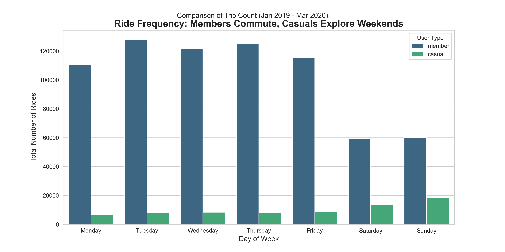
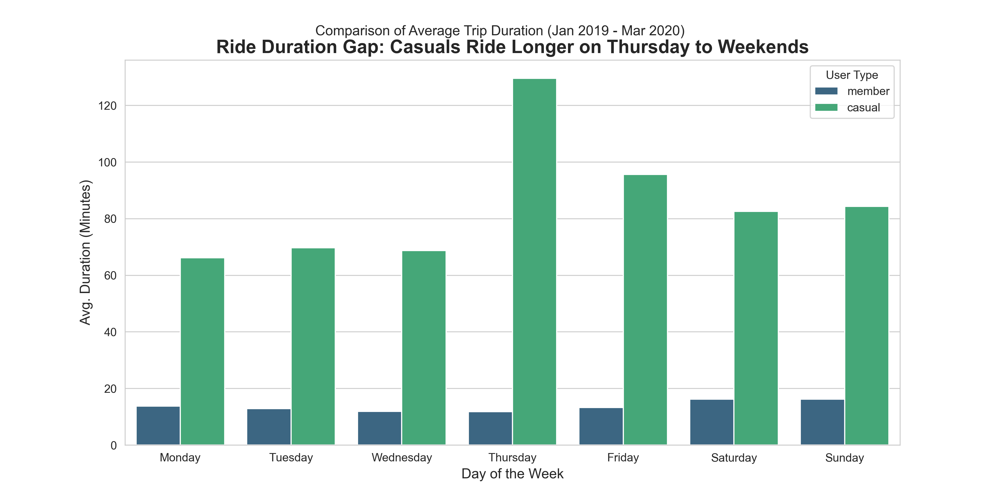

# 🚴‍♀️ Cyclistic Bike-Share: Case Study
**How does a bike-share navigate speedy success?**

## 👋 Introduction
Hi, I'm Azhar! As part of the Google Data Analytics Professional Certificate, I acted as a Junior Data Analyst for Cyclistic, a fictional bike-share company.

**The Goal:** Design marketing strategies to convert casual riders into annual members.
**My Role:** Analyze historical bike trip data to uncover trends and behavioral differences between these two groups.
**Tools Used:** Python (Pandas, Matplotlib, Seaborn) — *Chosen over Excel due to the large dataset size (700k+ rows).*

---

## 🧭 The Analysis Journey
I followed the six steps of the data analysis process to ensure a structured approach.

### 1. Ask
**Business Task:** Identify how annual members and casual riders use Cyclistic bikes differently.
* *Stakeholders:* Lily Moreno (Director of Marketing), Executive Team.

### 2. Prepare
I used public data provided by Motivate International Inc. (Divvy Trip Data).
* **Data Selection:** I selected the Q1 2019 and Q1 2020 datasets to compare year-over-year trends.
* **Privacy:** PII (Personally Identifiable Information) was removed ensuring data integrity.

**Data Source**
The data used for this analysis is available here:
* [Divvy Trip Data 2019 Q1](https://docs.google.com/spreadsheets/d/1uCTsHlZLm4L7-ueaSLwDg0ut3BP_V4mKDo2IMpaXrk4/template/preview?resourcekey=0-dQAUjAu2UUCsLEQQt20PDA#gid=1797029090)
* [Divvy Trip Data 2020 Q1](https://docs.google.com/spreadsheets/d/179QVLO_yu5BJEKFVZShsKag74ZaUYIF6FevLYzs3hRc/template/preview#gid=640449855)

### 3. Process
This phase involved cleaning the data to ensure accuracy.
* **Challenge:** The 2019 and 2020 datasets had different column names. I used Python to rename and standardize columns before merging.
* **Cleaning:** I removed trips with negative duration (system errors) and created new columns for `ride_length` and `day_of_week`.

### 4. Analyze
This is where the magic happened! I discovered three key insights:
1.  **The "Weekend Warrior" Effect:** Casual riders peak on Saturdays and Sundays, while members use bikes consistently on weekdays (commuting).
2.  **Duration Gap:** Casual riders stay on bikes 2x longer than members on average.
3.  **The Thursday Surprise:** While casuals ride *most often* on weekends, their *longest* rides actually happen on Thursdays.

### 5. Share
I created visualizations to communicate these findings effectively.

**Insight 1: Casuals ride for fun (Weekends), Members ride for work (Weekdays)**

**Insight 2: Casuals take their longest trips on Thursdays**

### 6. Act
Based on my analysis, I recommend three marketing strategies:
1.  **Launch a "Weekend Warrior" Mini-Membership:** A lower-cost pass valid only Fri-Sun to capture the casual market where they are most active.
2.  **"Thirsty Thursday" Gamification:** Since casuals ride long on Thursdays, offer a discount on annual membership for any rider who clocks >30 mins on a Thursday.
3.  **Commuter Challenges:** To encourage casuals to ride on weekdays, offer rewards for riding during peak commute hours (7-9 AM).

---

## 🚀 Personal Reflection
This project was my first deep dive into Python for data analysis. Initially, I attempted to use spreadsheets, but the file size (combining multiple quarters) caused performance issues. Switching to Pandas allowed me to process over 700,000 rows in seconds and gave me more control over the data cleaning process.
